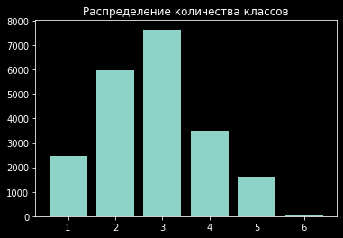

<h2>Мои полезные функции для Object Detection в Google Colab</h2>

<b>
Как использовать:
</b>
<pre>
!git clone https://github.com/DmitryMok/od_helper
%run od_helper/prepare_for_od.ipynb
</pre>

<b>Посмотреть разброс размеров изображений
</b>
<pre>
check_img_dir(dir=DIR_IMG)
</pre>
<pre>
Количество файлов в папке: 7019
Расширения: jpg

...идет обработка, подождите еще примерно 129 сек

</pre>

<b>Проверяем количество изображений и файлов разметки
</b>

<pre>
ds=DataSet([DIR_IMG],[DIR_LAB])
ds.get_stat()
</pre>

<pre>
Папки с изображениями:

/content/train_dir/images
  |
  +-- . [кол-во файлов - 7019, расширения: jpg]

Папки с файлами разметки:

/content/train_dir/annotations
  |
  +-- . [кол-во файлов - 7019, расширения: txt]
</pre>

<b>Выводим несколько изображений
</b>
<pre>
draw_imgs_from_path(DIR_IMG, 12)
</pre>

<pre>

</pre>

<b>Подробная статистика по классам
</b>
<pre>
ds.get_class_stat(img_list, bbox_list, ds_val.img_dirs[0], wh_offset=0)
</pre>

<pre>
Классы: 1 2 3 4 5 6

##################################################
КЛАСС - 1
##################################################

/content/train_dir/images/9999999_00309_d_0000137.jpg
[   2. 1174.  678.   56.  141.]

</pre>

<b>Фильтруем классы и размеры объектов
</b>
<pre>
idx = ds.get_filt_classes(img_list, bbox_list, ds.img_dirs[0], inc_cl=None, exc_cl=[0,7,8,11], mis_sq=0, max_sq=10e7)
</pre>

<pre>
Список классов: [ 0.  1.  2.  3.  4.  5.  6.  7.  8.  9. 10. 11.]
из 7019 изображений соответствует фильтру 2514 изображений (393719/87336)
включены классы None, исключены [0, 7, 8, 11], мин. площадь 0, макс. площадь 100000000.0

остались классы [ 1.  2.  3.  4.  5.  6.  9. 10.]
</pre>
